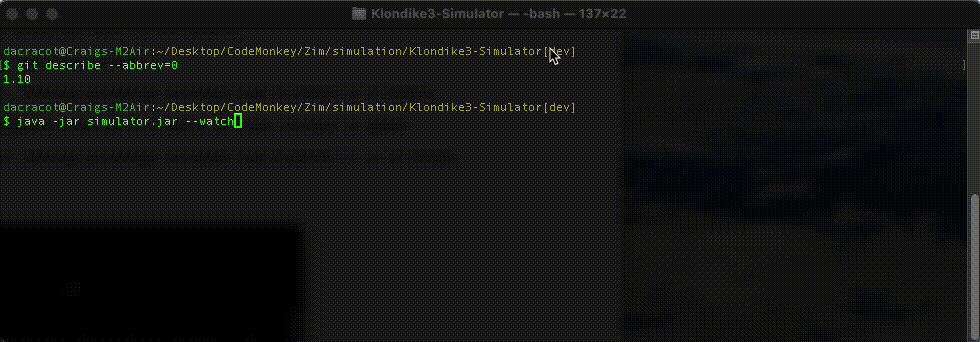

# Solitaire simulator for finding the best winning strategy...

Current record of **19.7%** is detailed in winningPercentage.txt.gz.

---

## Versions
- 1.12
  - Play altered to rescue a loss by returning foundation cards to the tableau.  Winning percentage increased from 17.81353% to 19.70935%.
- 1.11
  - Play altered to properly play until the end. Winnable games were left behind.  Winning percentage increased from 11.74316% to 17.81353%.
- 1.10, 1.10.1
  - Play unchanged. Added switch --watch, which plays a single, turn three, winnable game, one second per move, to the console.
- 1.9
  - Play unchanged. Changed terminology to commonly used, board -> tableau, goal -> foundation, and stack -> deck.
- 1.8, 1.8.1
  - Play altered to sort t2f to ascending column's hidden card count rather than left to right.  Winning percentage increased from 11.74316% to 11.74461%.
- 1.7, 1.7.1
  - While the intent was to create multi-threaded players, the change to better log buffer management resulted in a nearly 20 times increase in speed.
- 1.6
  - Play altered to sort t2t to descending column's hidden card count rather than left to right. Winning percentage increased from 8.54274%[^1] to 11.74316%.
- 1.5, 1.5.1
  - Play unchanged. Added more statistics and new criteria for best method.
- 1.4
  - Play unchanged. Added continuous mode and quiet operation.
- 1.3
  - Play unchanged. Cleaner output.
- 1.2
  - Play changed from {d2f, t2f, t2t, d2t} to {d2f, t2t, t2f, d2t} sequencing. Winning percentage increased from 7.915% to 8.590%.
- 1.1
  - Play is the same as 1.0, but deck shuffling can be repeatable via the seed parameter.
- 1.0
  - Very basic play using d2f, t2f, t2t, d2t only.
  - No effort to using smart alternatives.
    - For example | 9♠︎ | and | 9♣︎ | are both playable on | 10♥︎ |, but nothing but first encounter will choose one over the other.

## How To:
- run `ant`
  - Using Apache Ant to build project with default build.xml.
    - Targets are "clean" and "compile.java".  Default runs both.
- run `java -jar simulator.jar`
  - usage: `usage: [--watch | [--one|--three] [--attempts #|--continuous] [--debug|--quiet] [--seed #]]`
    - `--one`: Turn only one card each play.
    - `--three`: Turn three cards each play.
    - `--attempts`: Number of games to attempt.
    - `--continuous`: Attempt games until killed.
    - `--debug`: Verbose output about each game.
    - `--quiet`: Minimal output about each game.
    - `--seed`: Random seed for repeatable play.
    - `--watch`: Outputs at one second per move, a single winnable game. No other switch is considered.
  - For example: `java -jar simulator.jar --three --attempts 10 --seed 1111 > debug.out 2> debug.err`
    - Run java with the simulator jar.
    - Turn three cards for each turn.
    - Play ten games.
    - Shuffle the deck starting with the seed 1111.
    - Write standard output to debug.out.
    - Write standard error to debug.err.
  - Another example: `java -jar simulator.jar --watch`
    - Run java with the simulator jar.
    - Turn three cards for each turn.
    - Play a single winnable game.
    - Display each move in the console.
- run `java -jar simulator.jar --quiet --three --attempts 100000000 --seed 1111 > myWinningPercentage.txt` to determine your success rate verses the current record.
	- Compare your results with winningPercentage.txt and PR your file if better.

## Legend
- |•A♦︎•|: Ace of Diamonds face down.
- | A♦︎ |: Ace of Diamonds face up.
- t2t: from Tableau to Tableau
- t2f: from Tableau to Foundation
- f2t: from Foundation to Tableau
- d2t: from Deck to Tableau
- d2f: from Deck to Foundation

## Example Output
- Output from `java -jar simulator.jar --watch`:

[^1]:The winning percentage was previously report as 8.590% rather than 8.54274%.  The point of issue-60 was to better calculate the true winning percentage.  As the deck shuffle is truly random the winning percentage dances around accordingly, the only remedy being sample size.  Therefore calculation of winning percentage is based off of 100,000,000 games, not just 1,000,000.  The larger sample size moved the winning percentage even though the game play remained the same.