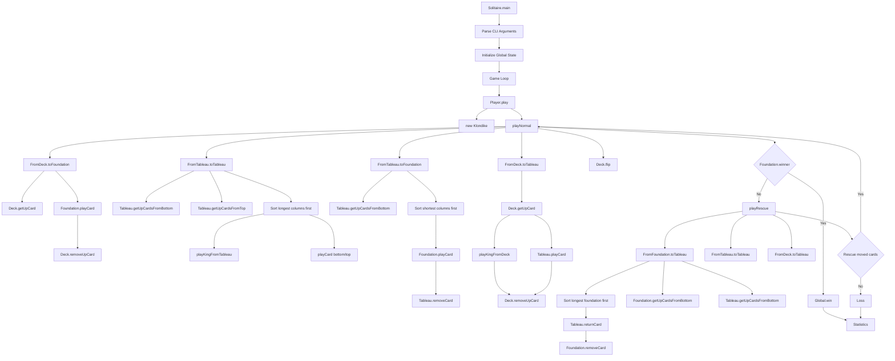

## Game play...

Description of the game play strategy currently in use.

---

# Deep Call Graph Analysis

The solver's execution graph is much more interesting than the high-level diagram suggests. The actual call hierarchy looks roughly like this:



## Actual Solver Decision Tree

The heart of the application is `Player.playNormal()`.

Every iteration executes in this exact order:

```text
1. Deck      -> Foundation
2. Tableau   -> Tableau (repeat until exhausted)
3. Tableau   -> Foundation
4. Deck      -> Tableau (repeat until exhausted)
5. Flip Stock
```

This is not merely a move list—it defines the entire search strategy.

---

## Tableau-to-Tableau Heuristic

Your strongest heuristic is here:

```java
Collections.sort(topUpCards, CardColumnLengthDescending);
```

This means:

```text
Candidate Moves
    ↓
Choose source column
    ↓
Longest column first
    ↓
Attempt move
```

Conceptually:

```text
Move Available?
│
├─ No
│   └─ Continue Search
│
└─ Yes
    │
    ├─ Exposes hidden card?
    │     └─ Highest Priority
    │
    └─ Otherwise
          First legal move
```

Hidden-card exposure is currently the dominant factor in solver success.

---

## Rescue Phase Graph

The new rescue phase behaves like a second search engine.

```text
Normal Play Fails
        │
        ▼
Return Foundation Card
        │
        ▼
Tableau → Tableau Exhaustively
        │
        ▼
Deck → Tableau Exhaustively
        │
        ▼
More Foundation Cards Available?
        │
 ┌──────┴──────┐
 │             │
Yes           No
 │             │
 ▼             ▼
Repeat     Resume Normal Play
```

Limited backtracking without undoing the whole game state.

---

## Foundation Return Logic

`FromFoundation.toTableau()`

```text
Foundation Cards
       │
       ▼
Sort Longest Foundation First
       │
       ▼
Find Tableau Target
       │
       ▼
Legal Return?
       │
 ┌─────┴─────┐
 │           │
No          Yes
 │           │
 ▼           ▼
Next Card  Remove From Foundation
                │
                ▼
           Return Success
```

Prioritizes dismantling the most advanced foundation pile first.

---

## Most Important Observation

The solver is not a pure greedy solver, instead it effectively implements:

```text
Greedy Search
      +
Limited Backtracking
      +
Hidden-Card Exposure Bias
```

The rescue phase converts the algorithm from:

```text
Single-path search
```

into:

```text
Search
    ↓
Dead End
    ↓
Partial Rollback
    ↓
Continue Search
```

which accounts for the larger winning percentage than common heuristic tweaks.
